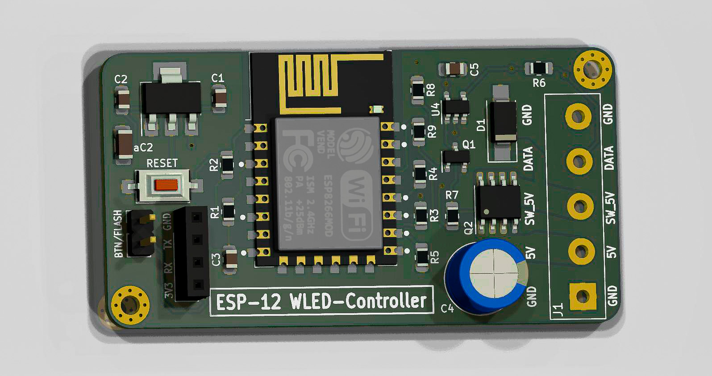
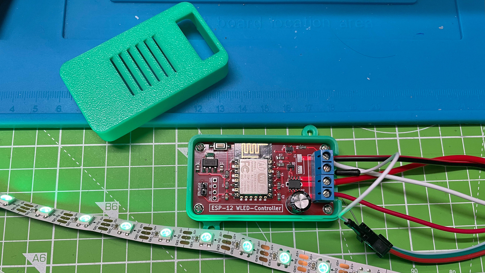
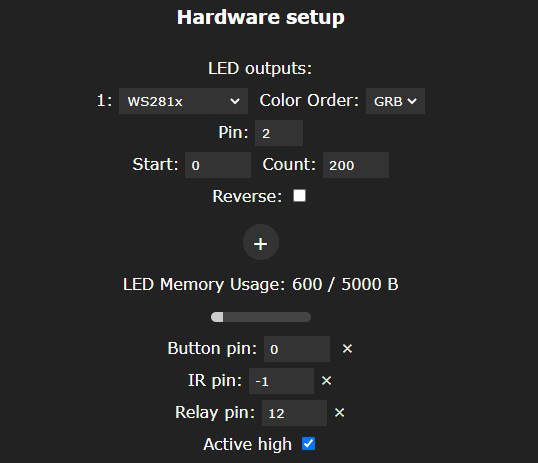

# ESP-12_WLED-Controller  
[English Version below](https://github.com/der-pw/ESP-12_WLED-Controller#english)

#### Achtung
**Der aktuelle Master-Branch enthält die ungetestete Version 2.0!**  
Die Platine wurde an einigen Stellen geändert. Daher gibt es noch keiner Gerberdaten.  
Die letzte getestete und bereits erfolgreich verwendete Version ist [V1.2](https://github.com/der-pw/ESP-12_WLED-Controller/tree/V1.2)  

----

Designidee eines EPS-12(E/F) basierten NeoPixel (WS2812B, WS2811, SK6812)-Controller speziell für [WLED](https://github.com/Aircoookie/WLED) oder auch Alternativen.

Übersicht:
 - [Versionen](https://github.com/der-pw/ESP-12_WLED-Controller#versionen)
 - [Gehäuse](https://github.com/der-pw/ESP-12_WLED-Controller#gehäuse) 
 - [Einstellungen](https://github.com/der-pw/ESP-12_WLED-Controller#einstellungen)
 - [Warum GPIO4?](https://github.com/der-pw/ESP-12_WLED-Controller#warum-gpio4-und-nicht-standard-gpio2)
 - [Teileliste](https://github.com/der-pw/ESP-12_WLED-Controller#teileliste)
 - [Anschluss Hinweise](wiring.md) ->

Die Idee war es, einen Controller zu bauen, der mit Pegelwandler arbeitet um das Datensignal, welches der ESP8266 nur mit 3,3V Pegel ausgibt, auf die vom LED-Strip benötigten 5V zu setzen. Gerade bei langen Datenleitungen kann ein 3,3V-Pegel sich schneller "verwaschen". 
Als Levelshifter werwende ich einen **74LVC1G125**.
Zusätzlich kann die Versorgungsspannung für den LED-Strip über einen P-Kanal MOSFET abgeschaltet werden. Auch im ausgeschalteten Zustand verbrauchen die NEOPIXEL-Strips Strom (ca. 1mA/Pixel). 
Footprints gibt es einmal als SOIC-8 und einmal als TO-220.  
Praktischerweise bietet WLED hier die Möglichkeit über einen frei definierten Pin ein "Relay" zu schalten. https://github.com/Aircoookie/WLED/issues/631#issuecomment-578551872  
Vor dem P-MOSFET sitzt ein weiterer N-MOSFET. Einmal funktioniert dieser als Treiber um den P-MOSFET mit 5V Logikpegel zu bedienen und zum anderen als Inverter, damit der große MOSFET bei einem HIGH-Pegel am GPIO12 des ESP2866 durchschaltet.

### Versionen:
 - 0.9 erstes Layout veröffentlicht
 - 1.0 kleine Änderungen und Fehler beseitigt
 - 1.01 C1 und C2 Korrektur der Werte (statt 10nF 10µF) hat keine Auswirkung auf die Platine
 - 1.1 Gatewiderstand R9 hinzugefügt
 - 1.2 Gatewiderstand Wert auf 300Ohm geändert
 - 2.0 Platinenlayout etwas überarbeitet  
 zweiter C2 Kondensator  
 A0 am Pinheader verfügbar gemacht, ermöglicht "sound reaction"
 Lötjumper unter R6 zum Überbrücken gesetzt  

### Gehäuse

Es gibt ein simples Gehäuse. 
Die beiden Geäusehälften werden zusammen geklipst.
Die Platine wird mittels 2x5mm Linsenkopfschrauben (Grobgewinde) im Gehäuse befestigt.

### Einstellungen
Die Platine verwendet folgendes Pin-Setting.  
Auf **GPIO0** kann ein externer Button verwendet werden, zum Ein- und Ausschalten und zusätzlich initiert man darüber den Flashvorgang.  
An **GPIO4** hängt das Datensignal und über **GPIO12** wird der MOSFET geschaltet.

#### Warum GPIO4 und nicht Standard GPIO2?
In WLED wird das Datensignal in ausgeschaltetem Zustang auf *HIGH* gelegt. Vermutlich um über einen N-MOSFET (einfacher) den Strip spannungsfrei zu bekommen und keinen "Rücklauf" über DATA zu haben.
Ich habe mich in meiner Schaltung bewusst für einen P-Kanal MOSFET entschieden weil so die Versorgungsspannung zum Strip abgeklemmt wird und nicht nur GND.
Auf GPIO4 wird zudem das Datensignal auf *LOW* geschaltet. Der Strip ist "soft off" quasi spannungsfrei.

### Teileliste
Bauteil        | Bestellnummer    | Anzahl | Kommentar
-------------- | ---------------- | ------ | ---------
C1, C2         | X7R-G0805 10U    |   2    | -
C3             | X7R-G0805 100N   |   1    | -
C4             | NHG-A 1,0M 6,3   |   1    | 11,5 mm hoch
J1             | CTB1202-4BK      |   1    | bis 16 A
Q1             | IRLML 6344       |   1    | -
Q2             | IRF 7410         |   1    | -
R1..R5, R7, R8 | RND 0805 1 10K   |   7    | -
R6             | RND 0805 1 470   |   1    | -
R9             | RND 0805 1 100   |   1    | -
D1             | SS 14 Schottkydiode   |   1    | Abhängig von der Last
SW1            | -                |   1    | -
U1             | TS 1117 BCW33    |   1    | -
U2             | -                |   1    | ESP-12E
U4             | SN 74LVC1G125DBV |   1    | -

Teileliste bei Reichelt: https://www.reichelt.de/my/1858254  
*bitte auf Vollständigkeit checken*

Diese Platine kann mit einem [fertigen Binary](https://install.wled.me/) verwendet werden.

## Dankeschön!  

Ein besonderer Dank geht an [Aircookie](https://github.com/Aircoookie) und allen Beteiligten, die am [WLED](https://github.com/Aircoookie/WLED) Projekt mitarbeiten.

----
## English

#### Attention

**The current master branch contains the untested version 2.0!**  
Circuit board has some changes. Therefore there is no Gerber data yet.  
The last tested and already successfully used version is [V1.2](https://github.com/der-pw/ESP-12_WLED-Controller/tree/V1.2).

----

Design idea of an EPS-12 (E / F) based NeoPixel (WS2812B, WS2811, SK6812) controller especially for WLED or alternatives.

Overview:
 - [Versions](https://github.com/der-pw/ESP-12_WLED-Controller#versions)
 - [Case](https://github.com/der-pw/ESP-12_WLED-Controller#case) 
 - [Settings](https://github.com/der-pw/ESP-12_WLED-Controller#settings)
 - [Why GPIO4?](https://github.com/der-pw/ESP-12_WLED-Controller#why-gpio4-instead-of-standard-gpio2)
 - [Parts list](https://github.com/der-pw/ESP-12_WLED-Controller#parts-list)
 - [Connecting Hints](wiring.md) ->
 

The idea was to build a controller that works with a level converter to set the data signal, which the ESP8266 only outputs with 3.3V level, to the 5V required by the LED strip. A 3.3V level can "wash out" more quickly, especially with long data lines. As a level shifter I use a 74LVC1G125. In addition, the supply voltage for the LED strip can be switched off via a P-channel MOSFET. Even when switched off, the NEOPIXEL strips consume electricity (approx. 1 mA / pixel). There are footprints once as SOIC-8 and once as TO-220.
Conveniently, WLED offers the possibility to switch a "relay" via a freely defined pin. https://github.com/Aircoookie/WLED/issues/631#issuecomment-578551872
Another N-MOSFET sits in front of the P-MOSFET. On the one hand it works as a driver to operate the P-MOSFET with 5V logic level and on the other hand as an inverter so that the large MOSFET switches through at a HIGH level at the GPIO12 of the ESP2866.

### Versions:
 - 0.9 first layout published
 - 1.0 minor changes and bugs fixed
 - 1.01 C1 and C2 wrong Values fixed (10µF instead of 10nF) has no effects of the PCB
 - 1.1 added gate resistor R9
 - 1.2 change gate resisitr value to 300Ohm
 - 2.0 board layout slightly revised
 second C2 capacitor
 A0 exposed at pin header, enables "sound reaction" feature
 Solder jumper placed under R6 resistor to bridge it

### Case

There is a simple case. The two halves of the housing are clipped together. The circuit board is attached to the housing by means of 2x5mm pan head screws (coarse thread).

### Settings
The board uses the following pin setting.
An external button can be used on GPIO0 to switch it on and off and also to initiate the flash process.
The data signal is connected to GPIO4 and the MOSFET is switched via GPIO12.

### Why GPIO4 instead of standard GPIO2?
In WLED, the data signal is set to HIGH when the status is switched off. Presumably to get the strip voltage-free via an N-MOSFET (may easier) and not to have a "way back" via DATA. I made a conscious decision to use a P-channel MOSFET in my circuit because it disconnects the supply voltage to the strip and not just GND. The data signal on GPIO4 is also switched to LOW. The strip is virtually tension-free "soft off".

### Parts list

Part           | Order Number     | Amount | Comment
-------------- | ---------------- | ------ | ---------
C1, C2         | X7R-G0805 10U    |   2    | -
C3             | X7R-G0805 100N   |   1    | -
C4             | NHG-A 1,0M 6,3   |   1    | 11,5 mm high
J1             | CTB1202-4BK      |   1    | till 16 A
Q1             | IRLML 6344       |   1    | -
Q2             | IRF 7410         |   1    | -
R1..R5, R7, R8 | RND 0805 1 10K   |   7    | -
R6             | RND 0805 1 470   |   1    | -
R9             | RND 0805 1 100   |   1    | -
D1             | SS 14 Schottky diode   |   1    | depends on the load
SW1            | -                |   1    | -
U1             | TS 1117 BCW33    |   1    | -
U2             | -                |   1    | ESP-12E
U4             | SN 74LVC1G125DBV |   1    | -

Parts list at Reichelt: https://www.reichelt.de/my/1858254  
*please check completeness*

PCB can be used with a [pre compiled binary](https://install.wled.me/).

## Thanks!  

Special thanks to [Aircookie](https://github.com/Aircoookie) and all the contributors at the [WLED](https://github.com/Aircoookie/WLED) project.
