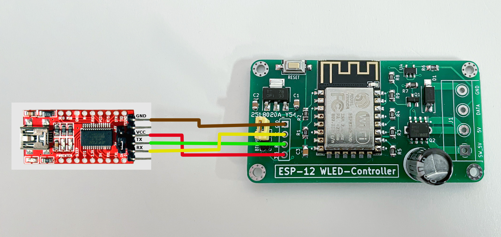
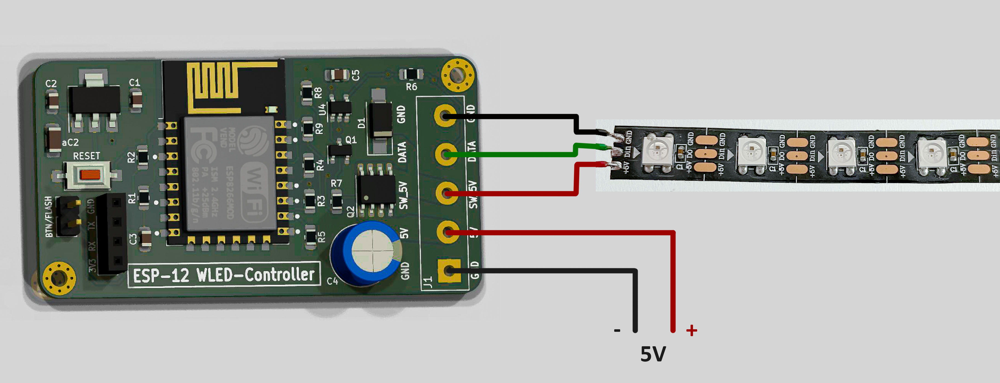

# ESP-12_WLED-Controller  [](https://creativecommons.org/licenses/by-sa/4.0/)
[English Version below](#english)

### Anschluss des Serial-UART Konverter (hier FTDI Adapter)


Der Jumper ```BTN/FLASH``` ist während des Flashvorganges, mindestens aber bei "Power ON" gebrückt, andernfalls wird der Flashvorgang nicht initialisiert.  

#### Installation von WLED
Die einfachste Möglichkeit, WLED zu installieren ist über die "ESP Web Tools" unter https://install.wled.me/ .  
Dort lassen sich fertige Binaries, ganz einfach über den Browser installieren. Weitere Infos findest du unter: https://kno.wled.ge/basics/install-binary/ .  


### Anschluss der Versogungsspannung und des LED-Strips


```GND``` teilen sich Strip und Netzteil aus Platzgründen  
```DATA``` Anschluss an die Datenleitung des LED-Strips  
```5V``` Versorgungsspannung vom Netzteil  
```SW_5V``` geschaltete Versorgungsspannung des LED-Strips, wird bei Nichtbenutzen deaktiviert, somit ist der Strip spannungsfrei

----
  

## English

### Connecting Serial-UART converter (in this case FTDI adapter)


The Jumper ```BTN/FLASH``` is bridges during des flashing progress, alternative at start up.
This initializes the flashing sequence.

#### Installation of WLED
The easiest way to install WLED is via the "ESP Web Tools" at https://install.wled.me/ .  
Pre compiled binaries can be easily installed in your browser. You can find more information at: https://kno.wled.ge/basics/install-binary/ . 

### Connecting power supply and LED strip


```GND``` is common to reduce the PCB size  
```DATA``` data line of the LED strip  
```5V``` supply voltage  
```SW_5V``` switched supply voltage of the LED strip is deactivated when not in use. So the strip is quite turned off
